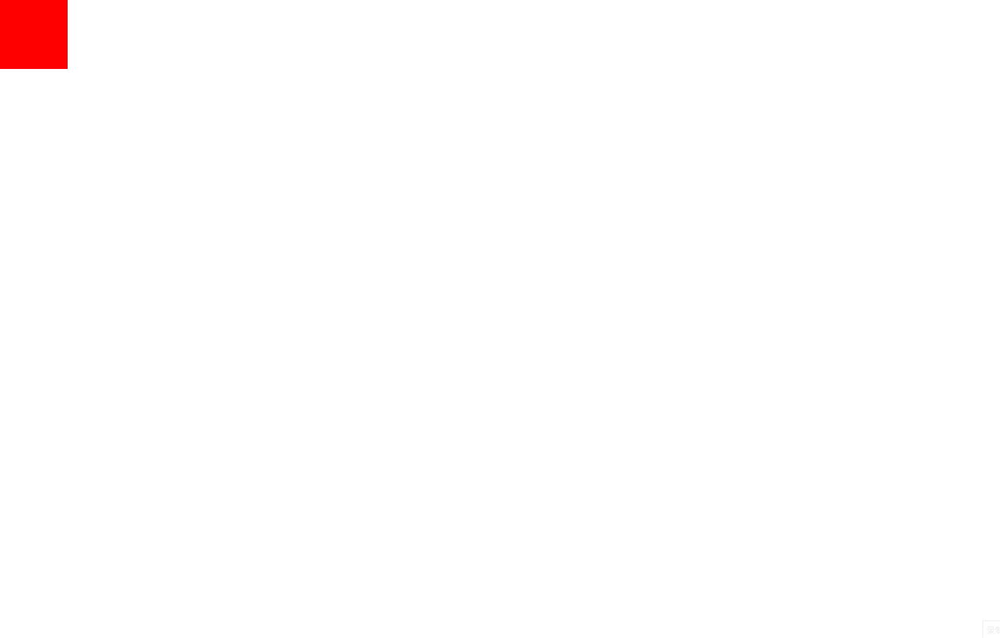

### Shuffling figure

> 轮播图是网页中非常常见的一个效果嘛，虽然现在很多 UI 库，直接帮我们实现好了，可是，要是只知道用别人造好的轮子，会让我们自己一个处理问题的能力变差，所以，我们在空闲时间，也来实现一个类似的功能，对我们会有一些帮助。

轮播图其实说白了，就是一个列表，在做 `运动`，一个 `缓冲运动`。所以，我们需要先让它动起来。

### 运动

```html
<!DOCTYPE html>
<html lang="en">
  <head>
    <meta charset="UTF-8" />
    <meta http-equiv="X-UA-Compatible" content="IE=edge" />
    <meta name="viewport" content="width=device-width, initial-scale=1.0" />
    <title>movement</title>
    <style>
      * {
        margin: 0;
        padding: 0;
      }
      .move {
        width: 100px;
        height: 100px;
        background: red;
        position: absolute;
        left: 0;
        top: 0;
      }
    </style>
  </head>
  <body>
    <div class="move"></div>

    <script>
      let moveDiv = document.querySelector(".move");
      moveDiv.onclick = function () {
        setInterval(function () {
          moveDiv.style.left = moveDiv.offsetLeft + 3 + "px";
        }, 10);
      };
    </script>
  </body>
</html>
```



当我们点击这个小红块的时候，就可以看到他就会动起来，但是会出现一个问题，就是他是一直向右运动，不会停止，这可不行，我们需要给他设置一个边界值。当到达这个边界值的时候，这个小红块就要停下来。

### 到预设边界时停止运动

现在，我们需要给这个小红块设置一个终点，当达到终点的时候，让他停止运动。

```html
    ...
    <style>
        ...
        .end{
            width: 1px;
            height: 100px;
            background: #000;
            position: absolute;
            left: 500px;
            top: 0;
        }
    </style>
</head>
<body>
    ...
    <div class="end"></div>
    <script>
        ...
        moveDiv.onclick = function () {
            let move = setInterval(function () {
                if(moveDiv.offsetLeft >= 500) {
                    moveDiv.style.left = 500; // 这是为了防止 小红块 距离 终点 会有一点的像素差，我们这边直接帮他进行一个复位
                    clearInterval(move);
                }else{
                    moveDiv.style.left = moveDiv.offsetLeft + 3 + 'px';
                }
            }, 10)
        }
    </script>
</body>
</html>
```


现在这个小红块就能停止了。

### 缓冲运动

我们现在离轮播图越来越近了，我们都知道，轮播图做的都是缓冲运动，速度是由快到慢的。

所以，我们的速度是一个可变的值，而不是和以前那样使用一个固定的值了。

```js
moveDiv.onclick = function () {
  let move = setInterval(function () {
    // 我们根据 moveDiv 到 终点的距离差，在除以一个自己设定的数值，那么速度就会由快到慢了就
    let speed = Math.ceil(Math.abs(moveDiv.offsetLeft - 500) / 30);
    // 当速度等于 0 的时候，我们就停止计时器
    if (!speed) {
      clearInterval(move);
    } else {
      moveDiv.style.left = moveDiv.offsetLeft + speed + "px";
    }
  }, 10);
};
```

;

你看，这不就完成了轮播图的第一次运动嘛，我们只需要把这个动作一直重复，那不就实现了一个轮播图嘛。

### 轮播图实战

现在根据我们刚刚所学的知识，写一个简易的轮播图。

> 关于样式和图标的话，需要的可以去这里取。

```html
<!DOCTYPE html>
<html lang="en">
  <head>
    <meta charset="UTF-8" />
    <meta http-equiv="X-UA-Compatible" content="IE=edge" />
    <meta name="viewport" content="width=device-width, initial-scale=1.0" />
    <title>Shuffling figure</title>
    <link rel="stylesheet" href="./index.css" />
  </head>

  <body>
    <div class="wrapper">
      <div class="btn left">&lt;</div>
      <div class="btn right">&gt;</div>
      <ul>
        <li></li>
        <li></li>
        <li></li>
      </ul>
    </div>
    <script src="./index.js"></script>
  </body>
</html>
```

```js
let lock = true; // 用于控制当前能不能做缓冲运动
let current = 0; // 当前图片的索引
let index = 0; // 当前 point 的索引

function shuffling(shufflingContainer, moveContainer, leftBtn, RightBtn) {
  let ul = document.querySelector(moveContainer); // 移动的容器
  let wrapper = document.querySelector(shufflingContainer); // 固定的容器
  let left = document.querySelector(leftBtn); // 左边按钮
  let right = document.querySelector(RightBtn); // 右边按钮

  // 创建小按钮，并且把它添加到固定容器中，最后返回这个容器
  let point = createPoint(wrapper, ul);

  // 创建一个 li， 这个 li 要和第一个 li 一样，然后添加到 移动容器的末尾
  ul.appendChild(createLi());

  // 点击按钮之后，轮播图移动的方向
  left.onclick = function () {
    direction("left", wrapper.clientWidth, ul);
  };
  right.onclick = function () {
    direction("right", wrapper.clientWidth, ul);
  };

  // point 小按钮的点击事件
  point.addEventListener("click", function (e) {
    // 当点击的对象为小按钮时才触发事件
    if (e.target.className.indexOf("item") !== -1) {
      // 获取每个按钮当前的索引
      let index = e.target.getAttribute("data-index");
      // 根据当前索引和原索引来做判断是往哪个方向移动
      let direction = current > +index ? "right" : "left";
      if (lock) {
        current = +index;
        // 切换小按钮的选中状态
        handleActive(current, point);
        // 执行运动函数
        move(wrapper.clientWidth, 10, 30, current, direction, ul);
      }
    }
  });

  // 自动轮播   默认方向为 从右到左  默认的时间间隔为 3秒
  setInterval(function () {
    direction("left", wrapper.clientWidth, ul);
  }, 3000);
}

// 移动函数
function move(liwidth, interval, velocity, current, direction, moveContainer) {
  // 要移动的距离
  let width = liwidth * current;
  // 加锁，防止开启多个定时器
  if (lock) {
    // 关锁
    lock = false;
    let time = setInterval(function () {
      // 根据轮播图移动的方向，来设置速度
      let speed =
        direction === "left"
          ? Math.ceil((width - Math.abs(moveContainer.offsetLeft)) / velocity)
          : Math.floor((width - Math.abs(moveContainer.offsetLeft)) / velocity);
      if (!speed) {
        // 当 speed 为 0 的时候，清除定时器，并且开锁
        clearInterval(time);
        lock = true;
      } else {
        moveContainer.style.left = moveContainer.offsetLeft - speed + "px";
      }
    }, interval);
  }
}

// 根据方向，来执行移动函数
function direction(dir, liwidth, moveContainer) {
  if (lock) {
    // 当移动方向为 从右往左 时
    if (dir === "left") {
      // 当 图片的索引 等于 移动容器中子项的数量时，也就是到了最后一张图片时
      if (current === moveContainer.children.length - 1) {
        //  把移动容器的 left 值设置为 0
        moveContainer.style.left = 0;
        // 并且把 图片的索引设置为 1
        current = 1;
      } else {
        // 其他情况的话，就一直对索引加 1
        current++;
      }
      // 当移动方向为 从左往右 时
    } else if (dir === "right") {
      // 当在第一张图片的时候
      if (current === 0) {
        // 我们把移动容器的值设置成最后一张图片的位置
        moveContainer.style.left =
          -((moveContainer.children.length - 1) * liwidth) + "px";
        // 然后把 图片的索引进行修改，赋值成我们倒数第二张的索引
        current = moveContainer.children.length - 2;
      } else {
        // 其他情况下，就一直对索引减 1
        current--;
      }
    }
    // 这一块是设置 point 的 index 索引，用来切换 point 的选中状态
    if (current === moveContainer.children.length - 1) {
      index = 0;
    } else {
      index = current;
    }
    // 切换 point 的选中状态
    handleActive(index, document.querySelector(".point-container"));
    // 根据前面处理过的数据，执行移动函数
    move(liwidth, 10, 30, current, dir, moveContainer);
  }
}
// 创建一个li，并且返回这个新创建的li元素
function createLi() {
  return document.createElement("li");
}

// 创建 point 小按钮，并且添加到固定容器中去
function createPoint(shufflingContainer, moveContainer) {
  let point = document.createElement("div");
  point.classList = "point-container";
  shufflingContainer.appendChild(point);

  [...moveContainer.children].forEach((ele, index) => {
    let item = document.createElement("div");
    if (current === index) {
      item.classList = "item active";
    } else {
      item.classList = "item";
    }
    item.setAttribute("data-index", index);
    point.appendChild(item);
  });

  return point;
}

// 切换 point 的选中状态
function handleActive(index, container) {
  [...container.children].forEach((ele) => {
    ele.className = "item";
  });
  container.children[index].classList = "item active";
}
```


